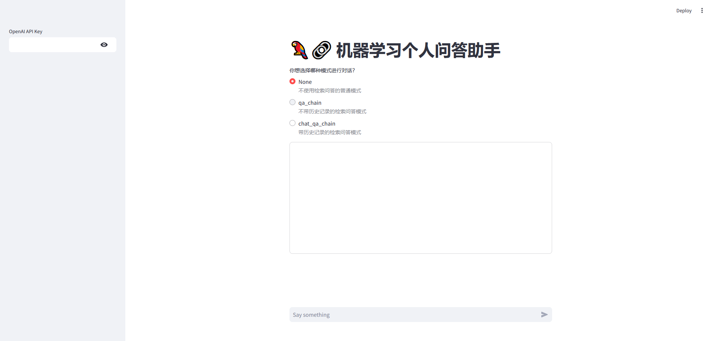

# 机器学习个人问答助手web开发
基于智谱大模型实现知识助手Web的实现

## 项目简介
该项目采用RAG技术，实现个人知识库助手web项目创建，调用智谱大模型，采用langchain的Chroma库来存储向量，采用langchain的对话chain类实现历史对话功能，使用streamlit库实现web界面的快速搭建

**目录结构说明：**

├── data_base：所使用的知识库源文件/n\n
      ├── knowledge_db:待向量化的知识库
      ├── vector_db:向量化的知识库
├── streamlit_app.py：问答助手web的实现
├── requirements.txt：官方环境下的安装依赖
├── vectorstores_creat.py：向量库创建
├── zhipuai_embedding.py：智谱向量化实现
├── zhipuai_llm.py：智谱模型接口实现
└── .env：环境配置

## 项目运行
streamlit run streamlit_app.py

## 项目运行结果图

